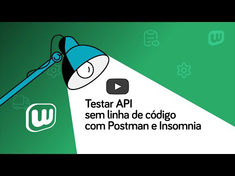

  

Utilize a ferramenta Postman para realizar testes instântaneos nas API's da WebmaniaBR e obter exemplos de integração em mais de 15 linguagens de programação. É só importar e testar, veja como é simples.

## Requisitos
  - Instalar Postman: [Download](https://www.getpostman.com/downloads/)
  - Contrate um dos planos de Nota Fiscal Eletrônica da WebmaniaBR® a partir de R$29,90/mês. [Assine agora mesmo](https://webmaniabr.com/nota-fiscal-eletronica/)
  
## URL Postman
- **API de Nota Fiscal:** https://www.getpostman.com/collections/d62dbbb01a977b12695f
- **API de CEP:** https://www.getpostman.com/collections/618a106f39e6d1d4a694

## Vídeo explicativo

Veja no vídeo a seguir como é fácil testar a API de Nota Fiscal da WebmaniaBR utilizando o Postman e Insomnia. Ou se preferir, você pode seguir as instruções logo abaixo.

  

## Instruções

Com o postman instalado e aberto clique em *import*, que fica localizado na parte superior esquerdo, como na imagem abaixo:

  

Clique na opção *Import From Link* e insira a URL Postman no campo *"Enter a URL and press Import"* da API que deseja e clique em Import. 
Você também pode realizar a importação pelas opções *File* e *Raw text*, utilizando os arquivos .json nas pastas API_CEP ou API_NotaFiscal.

  

Pronto, o Postman cria automaticamente uma coleção com todos os exemplos de requisições da nossa API:

  

Agora é só configurar suas credenciais de acesso para que as requisições funcionem, sem isso, não será possivel realizar os testes na REST API. As credenciais devem ser informados no Headers das requisições:

  

Pronto seu Postman está pronto para enviar requisições via API, clique agora em **Send** e receba a resposta da nossa API.

  

**Resposta:**

  

## Suporte

Ficou com dúvida? Sem problema, entre em contato com a gente em [Central de Ajuda](https://ajuda.webmaniabr.com) ou acesse o [Painel de Controle](https://webmaniabr.com/painel/) para conversar em tempo real no Chat ou Abrir um chamado.
